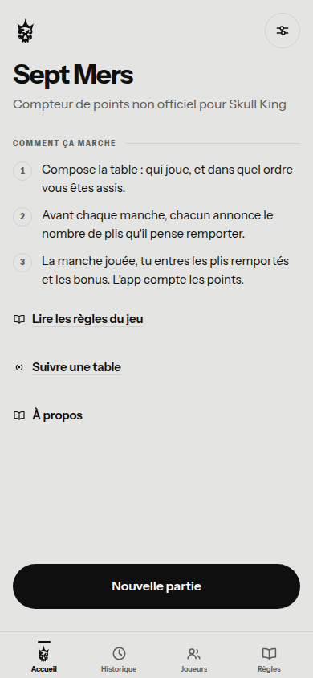
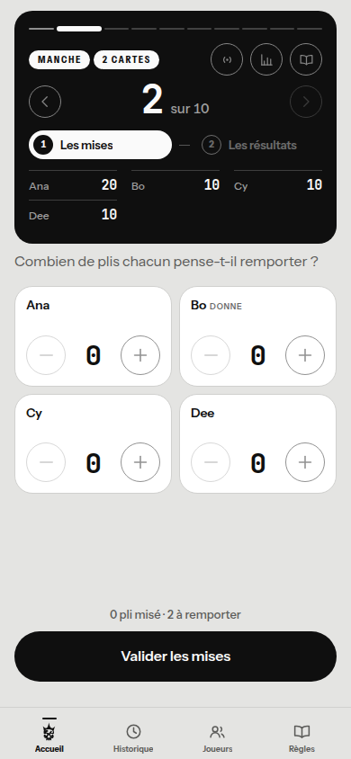
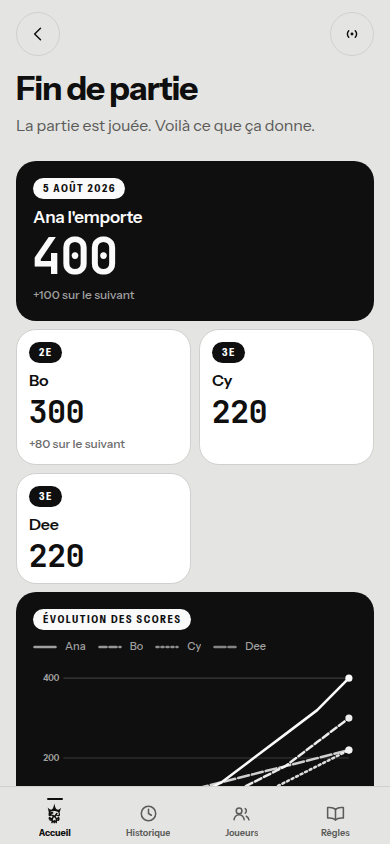
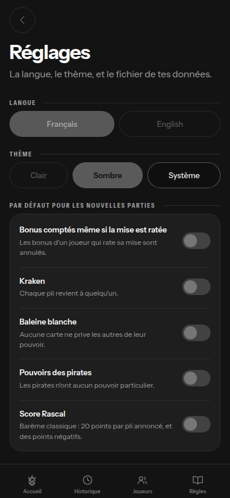

# Sept Mers

**Compteur de points non officiel pour Skull King.**
Front only, hors ligne, sans compte, sans serveur, sans suivi.

Sept Mers remplace le carnet de score papier autour d'une table. L'app répond à
quatre questions, vite, sur un téléphone qui passe de main en main : qui a parié
quoi, qui a tenu son pari, qui mène, et quelle était déjà la règle sur les
sirènes. Elle ne joue pas, ne conseille pas, et ne suit pas les cartes jouées.

<p>
  
  
  
  
</p>

Les images sont produites par le parcours navigateur lui-même —
`node scripts/smoke.mjs --captures` —, donc elles montrent toujours l'app telle
qu'elle est construite, jamais telle qu'elle était.

## Ce qu'elle fait

- **Score classique**, 2 à 8 joueurs, 10 manches, tout calculé par l'app.
- **Format réglable** : le nombre de manches, et les cartes de la première. La
  donne monte toujours d'une carte par manche à partir de là, et le panneau dit
  ce que ça donnera à cette table avant de distribuer. Le format se fige avec la
  partie : une partie de 6 manches relue dans l'historique se relit en 6
  manches, même si le réglage a changé depuis.
- **Les variantes en option**, choisies au lancement d'une partie et expliquées
  dans les règles : le Kraken et la Baleine blanche, deux cartes et **deux
  bascules** — le Kraken écarte le pli où il tombe, la Baleine ne l'écarte que
  dans le cas rare où personne n'a posé de numéro, et n'en glisser qu'une au
  paquet fait 71 cartes et non 72 ; les pouvoirs des pirates, dont deux changent
  le score — le pari de Rascal Jack, et **Harry le Géant**, qui déplace une mise
  d'un pli une fois les cartes en main ; le **Score Rascal**, second barème où
  chaque manche vaut 10 points par carte pour tout le monde — tout, la moitié,
  ou rien selon l'écart à la mise, et jamais de points négatifs. Il ouvre à son
  tour le **Boulet de canon**, que chacun charge après avoir misé : 15 points
  par carte, mais rien du tout au moindre écart.
- **Le fantôme de Barbe Grise à 2 joueurs**, sans rien à régler. Le jeu y
  distribue une troisième main, qui rafle des plis sans miser ni marquer : la
  somme des plis des 2 joueurs ne fait donc plus le nombre de cartes de la
  manche. L'app lui donne une tuile, qui se remplit du reste et reste
  corrigeable — l'égalité qu'elle vérifie n'est pas relâchée, elle est élargie.
- **Saisie sans clavier virtuel** : une grille de tuiles, une par joueur, avec
  un contrôle moins / plus. Appui maintenu pour défiler. Les mises partent à zéro,
  les plis partent sur la mise de chacun, et le dernier joueur qu'on n'a pas
  repris en main se complète tout seul — une manche où tout le monde tient sa
  mise se valide sans un geste.
- **Les cinq bonus** derrière un bouton nommé sur chaque tuile, avec leurs
  bornes matérielles : on ne peut pas attribuer trois sirènes ni faire capturer
  le Skull King deux fois. La même feuille porte le pari de Rascal Jack et le
  pas d'Harry le Géant, qui se posent aux résultats : la mise annoncée reste
  écrite sur la tuile, suivie de celle qu'on a réellement défendue.
- **Plafond du paquet** appliqué automatiquement : à 8 joueurs et au format du
  livret, les manches 9 et 10 se jouent à 8 cartes — 9 avec les deux monstres
  marins, que les 2 cartes de plus suffisent à faire tenir la manche 9.
- **Reprise exacte** de la manche et de la phase après fermeture de l'app.
- **Partage de table** : les autres joueurs suivent la partie en direct sur
  leur propre téléphone, en lecture seule — mises, plis, totaux, la manche en
  cours, puis le résultat. Un code de six caractères ou un QR pour
  rejoindre ; pair-à-pair et chiffré, sans compte ni serveur. Et un
  **lien-résumé** qui fige la partie dans l'adresse elle-même, à envoyer dans
  la conversation du groupe ou à faire scanner — celui-là marche même sans
  réseau.
- **Marche arrière** : on revient à la manche précédente pour la corriger, et la
  saisie en cours est mise de côté le temps qu'on y retourne.
- **Quatre graphiques** en SVG écrit à la main : évolution des scores d'une
  partie, précision des mises, palmarès des joueurs récurrents, et la tendance
  d'un joueur d'une partie à l'autre.
- **Règles réécrites**, consultables depuis l'accueil ou en feuille modale sans
  quitter la manche en cours.
- **Français et anglais**, thème clair, sombre ou système, changeables à chaud.
- **Export / import** du fichier de données.
- **Aucun scroll latéral**, à aucune largeur : tout se plie à l'écran.
- **Design en mosaïque, monochrome** : des widgets noir, blanc ou gris, un
  chiffre en héros par widget. Voir [le design system](docs/design-system.md).
- **Deux familles typographiques** : une pour la voix, une chasse fixe pour les
  chiffres. Les deux sont embarquées et précachées : rien à télécharger, y
  compris en mode avion.
- **Barre de navigation basse**, quatre destinations, présente y compris au
  milieu d'une manche : aller lire une règle ne fait perdre ni la partie ni la
  saisie en cours.
- **Guidage permanent** : trois phrases au premier lancement — et un écran
  **À propos** qui les redonne à tout moment, avec ce que fait l'app, comment
  l'installer, et à qui elle appartient —, une consigne sous chaque titre
  d'écran, la progression de la partie affichée en continu, et un blocage qui
  se nomme avant de griser un bouton.
- **Noms entiers partout**, jamais une initiale ni une pastille de couleur. Dans
  le tableau des scores, les huit noms sont écrits en diagonale pour tenir dans
  la largeur d'un téléphone. La couleur ne porte jamais seule une information.
  Deux joueurs ne peuvent pas porter le même nom, où qu'on les ajoute.
- **Le donneur**, qui tourne d'un siège par manche dans l'ordre à table et se
  nomme sur sa tuile. Il se déduit de la manche : rien de plus sur le disque, et
  une partie relue dans l'historique retrouve le même.
- **Trois sorties de partie**, nommées : quitter sans rien fermer, voir le
  résultat maintenant — la table qui s'arrête à la manche 6 sur 10 a un
  résultat, et il le dit —, ou abandonner. Une partie qui n'est pas allée au
  bout de son format est marquée *écourtée* : son classement reste vrai, et
  elle ne pèse pas dans les statistiques.
- **Statistiques par joueur** : victoires et moyenne, mais aussi la plus longue
  série de mises tenues, la précision par taille de main — tenir sa mise à une
  carte n'est pas la tenir à neuf —, le face-à-face contre chaque joueur croisé,
  et l'évolution d'une partie à l'autre.
- **Historique filtrable** par joueur, sous le nom qu'il portait alors.
- **Tout se saisit au clavier** autant qu'au doigt : le compteur prend le focus
  et répond aux flèches, à Origine et à Fin. Le parcours navigateur le vérifie.

## Faire tourner le projet

```bash
npm install
npm run dev        # serveur de développement
npm run verify     # types, tests et build
npm run build      # bundle de production dans dist/
```

Node 22. Le champ `engines` déclare `22.x` plutôt qu'une plage : c'est la forme
que les hébergeurs reconnaissent sans discuter. Vite 7 demande au minimum
Node 22.12, que toute version 22 récente satisfait.

| Script | Ce qu'il fait |
|---|---|
| `npm run dev` | Vite en développement |
| `npm run build` | Vérification des types puis bundle de production |
| `npm run test` | Tests Vitest sur `domain/`, `store/`, `share/`, `i18n/` et `charts/` |
| `npm run typecheck` | TypeScript seul |
| `npm run verify` | Les trois d'affilée |
| `node scripts/smoke.mjs` | Parcours complet dans un vrai navigateur, sur `dist/` |
| `node scripts/share.mjs` | Partage de table en direct et lien-résumé, à deux pages |
| `node scripts/offline.mjs` | Mode avion et suivi du thème système, sur `dist/` |
| `node scripts/nooverflow.mjs` | Absence de scroll latéral, à cinq largeurs |
| `node scripts/contrast.mjs` | Absence de texte illisible, dans les deux thèmes |
| `node scripts/licenses.mjs` | Licences distribuées avec le build : dépendances et fontes |
| `python3 scripts/make-icons.py` | Regénère les icônes et le `favicon.ico` depuis le logotype |

Les cinq parcours navigateur ont besoin d'un Chromium. Après
`npx playwright install chromium` ils le trouvent seuls ; `scripts/browser.mjs`
regarde d'abord `CHROMIUM_PATH`, puis les emplacements où un Chromium
préinstallé se trouve d'ordinaire, et laisse Playwright résoudre à défaut.

`scripts/smoke.mjs` joue une partie entière à quatre, vérifie la reprise après
rechargement, le plafond à huit joueurs, la tuile du fantôme à deux joueurs, le
Score Rascal et sa pastille de charge, le changement de thème et de langue,
l'absence de requête réseau et l'absence d'emoji. Il vérifie aussi que le
compteur — mises, plis, format, primes — s'utilise entièrement au clavier, ce
qu'aucun test ne voyait tant que tous les parcours cliquaient. Il attend un
`dist/` à jour. L'option `--shots` écrit des captures pleine page dans
`shots/` ; `--captures` écrit celles du README dans `docs/captures/`.

`scripts/share.mjs` fait suivre une partie par une seconde page du même
navigateur : salle ouverte depuis l'écran de manche, code et QR affichés, mises
et manches propagées en direct, correction annoncée en face, rechargement du
téléphone de la table qui rouvre la salle tout seul, fin de partie vue par le
spectateur, arrêt annoncé, puis lien-résumé rouvert. Le transport y est local —
c'est le même fil, sur `BroadcastChannel` — et le parcours vérifie qu'aucune
requête ne sort et que le chunk de Trystero n'est jamais chargé.

`scripts/offline.mjs` coupe le réseau une fois le service worker installé, puis
relance l'app, valide une manche et ouvre les règles hors ligne. Il vérifie que
le direct nomme son blocage en mode avion pendant que le lien-résumé reste
offert, et que le thème système bascule en direct, sans rechargement.

`scripts/nooverflow.mjs` parcourt les seize écrans à 320, 360, 390, 430 et
820 px, avec huit joueurs et la valeur la plus haute, et échoue dès qu'un
élément dépasse la largeur ou qu'un composant défile horizontalement. La
pastille de charge et la tuile du fantôme y ont leur passe : c'est là qu'une
tuile de demi-largeur se serait fendue en deux rangées.

`scripts/contrast.mjs` mesure le contraste réel de chaque texte contre son fond
effectif, dans les deux thèmes. Il attrape la classe de défaut qui ne casse
rien par ailleurs : un bloc qui pose une surface sans publier ses couleurs de
texte, et dont le contenu devient blanc sur blanc.

## Architecture

```
src/
  main.tsx
  app/          App, Router, Layout, TabBar, StoreProvider, ThemeProvider,
                useWakeLock, useInstall
  screens/      Home, NewGame, Game, GameSummary, History, Players, Rules,
                Settings, Watch, Recap, About
  components/   Widget, Button, Stepper, Rail, PlayerChip, ScoreTable, Sheet,
                Toast, Icon, EmptyState, BonusDrawer, OptionSwitch, QrCode
  domain/       scoring, deck, validation, stats, types
  store/        storage, reducer, migrations
  share/        protocol, codec, code, qr, transport, loopback, trystero,
                session, ShareProvider, ShareSheet, Board, useSpectator
  charts/       ScoreLines, AccuracyBars, RankingBars, PlayerTrend, primitives
  i18n/         fr.json, en.json, index
  content/      rules.fr, rules.en, RulesBody, HowItWorks
  styles/       tokens.css, fonts.css, base.css, fonts/*.woff2
public/         manifest.webmanifest, sw.js, icons/
docs/           design-system.md, captures/
```

**React 19 + TypeScript + Vite, et deux dépendances d'exécution, choisies pour
le partage de table** : `trystero`, le pair-à-pair, qui n'arrive que par un
`import()` au moment de partager — le bundle d'entrée n'en contient pas une
ligne, et `scripts/share.mjs` le vérifie sur le build — et `uqr`, qui calcule
la matrice des QR ; leur rendu SVG reste maison. En développement s'ajoutent
Vitest et Playwright, pour les parcours navigateur. Pas de routeur, pas de
librairie d'état, pas de Tailwind, pas de librairie de graphiques, pas de pack
d'icônes. Les deux fichiers de police vivent dans `src/`
pour que Vite leur pose un hash de contenu et que le service worker les
précache avec le bundle. Le routeur tient sur `history.pushState`, l'état sur un
`useReducer` persisté, les styles sur des variables CSS et des modules CSS, les
graphiques sur du SVG calculé à la main.

Le moteur de score (`domain/scoring.ts`) est un module pur : il prend une mise,
des plis, un nombre de cartes et un objet d'options, et rend un score. Il ne lit
ni horloge ni stockage. C'est par cet objet d'options que les variantes sont
arrivées, et non par une réécriture : le pari de Rascal Jack s'ajoute au total
sans passer par les primes, puisque l'option qui annule les primes d'une mise
ratée ne l'annule pas. Le second barème suit la même règle — le corps classique
a été déplacé tel quel dans une fonction privée, le Score Rascal en est une
seconde, et `scoreRound` aiguille. Les huit cas de référence n'ont pas bougé
d'une ligne.

Le fantôme de Barbe Grise, lui, n'est pas passé par les options : à 2 joueurs il
n'y a pas d'autre façon de jouer. Il porte un identifiant sentinelle et rejoint
la liste des *porteurs de plis*, distincte de celle des joueurs. Tout ce qui
parle de plis — le semis, la déduction du dernier non repris en main, la
validation de la somme, le compteur de pied d'écran — prend la première ; tout
ce qui parle de mise, de prime, de pari ou de score prend la seconde. Il n'a
donc fallu écrire aucun mécanisme parallèle, seulement allonger une liste.

Le partage de table suit le même partage des rôles : un seul écrivain — le
téléphone qui saisit — diffuse l'état complet, les autres le lisent. La charge
utile est `{ game, draft }`, que `Game` rend autoportante en embarquant ses
noms et ses options ; tout ce qui est reçu repasse par `normalise`, le
relecteur défensif du stockage, comme un fichier importé — et rien de reçu ne
s'écrit jamais dans le stockage du téléphone qui regarde. Le transport est une
interface à deux implémentations : Trystero — WebRTC de téléphone à téléphone,
signaling chiffré passant par des relais Nostr publics — et un
`BroadcastChannel` local, qui porte les tests et les parcours. Le lien-résumé
compacte la même charge en tableaux de position, la déflate avec le
`CompressionStream` du navigateur, et la pose en base64 d'URL dans le fragment
de l'adresse — quelques centaines de caractères pour une partie pleine, qui
tiennent dans un QR.

Le stockage tient dans une clé `localStorage`, écrite avec 300 ms de debounce et
vidée dès que l'onglet passe en arrière-plan. La lecture est défensive : un
fichier abîmé ou bricolé à la main ne doit pas empêcher l'app de démarrer autour
d'une table. `store/migrations.ts` existe déjà, vide, pour que la prochaine
version de schéma soit une addition et pas une réécriture. La session de
partage, elle, vit sous une clé à part — un code de salle éphémère n'a rien à
faire dans un export — et survit ainsi à un rechargement accidentel du
téléphone de la table.

## Tests

416 tests unitaires couvrent les deux moteurs de score — dont les huit cas de
référence du cahier des charges, et l'absence de tout point négatif ou
fractionnaire sur toute la grille du Score Rascal —, la validation de saisie, le
plafonnement du paquet, les variantes, le fantôme de Barbe Grise, les
statistiques, le réducteur, le préremplissage et la complétion automatique du
dernier joueur, la marche arrière entre manches, l'aller-retour export/import,
la lecture défensive du stockage, le partage de table — protocole et
durcissement de l'état reçu, aller-retour du lien-résumé jusqu'aux liens
hostiles et à sa taille au pire de la grille, alphabet et tirage du code de
salle, transport local, session de diffusion, géométrie des QR —, les
pluriels, la géométrie des graphiques, la configuration de déploiement, les
icônes d'installation, le donneur et les parties écourtées, l'unicité des noms,
les jetons de la palette et le système typographique — familles, échelle,
fichiers de fonte embarqués, et l'absence de toute famille écrite en dur hors
des jetons. Un test refuse aussi toute clé de traduction que plus personne
n'emploie : dix-sept traînaient sans que rien ne le dise. Les parcours navigateur complètent le tout sur
l'app réellement construite.

```bash
npm run verify \
  && node scripts/smoke.mjs \
  && node scripts/share.mjs \
  && node scripts/offline.mjs \
  && node scripts/nooverflow.mjs \
  && node scripts/contrast.mjs \
  && node scripts/licenses.mjs
```

Ces sept vérifications tournent à chaque poussée et à chaque pull request, dans
[`.github/workflows/verification.yml`](.github/workflows/verification.yml), sur
la même majeure de Node que le déploiement.

## Déploiement

L'app est un site statique : `npm run build` produit `dist/`, et n'importe quel
hébergeur de fichiers suffit. `vercel.json` est fourni pour Vercel — préréglage
Vite, aucune variable d'environnement, aucune fonction serveur.

Ce fichier ne contient **aucun commentaire** : JSON n'en a pas, et le schéma de
Vercel refuse toute propriété inconnue, y compris une clé `"//"` employée comme
telle. Le déploiement échoue alors à la validation, avant même le clonage, avec
un « Deployment failed » sans journal — trois clés glissées dans `headers` ont
suffi. `src/deploy.test.ts` le vérifie, avec le reste de la configuration : les
clés autorisées à chaque niveau, le comportement réel de la redirection, et la
forme de `engines.node`. Les explications, elles, vivent ci-dessous.

| Fichier | Cache | Pourquoi |
|---|---|---|
| `sw.js`, `sw-version.js` | aucun | Ce sont eux qui portent la liste des fichiers à précacher. Un service worker périmé empêche toute mise à jour d'arriver, définitivement. |
| `manifest.webmanifest` | aucun | Il change avec le thème et les icônes. |
| `assets/*` | un an, immuable | Ces fichiers portent un hash de contenu : leur nom change à chaque build. |
| `icons/*` | un jour | Ils n'ont pas de hash, et on doit pouvoir les corriger. |

### Les routes

Les écrans ont de vraies adresses — `/new`, `/rules`, `/summary/<id>` — et non
un hash. Deux conséquences, dans les deux sens :

- **L'hébergeur doit les connaître.** `vercel.json` déclare une *réécriture* :
  toute adresse qui n'est pas un fichier reçoit `index.html`, **à son adresse**,
  sans redirection. Une redirection changerait la barre, ce qui est précisément
  ce qu'on veut éviter. Sur un autre hébergeur, c'est la même règle sous un
  autre nom — `try_files` chez nginx, `_redirects` chez Netlify.
- **Le build se sert depuis la racine** (`base: '/'` dans `vite.config.ts`).
  Une URL relative se résout contre l'adresse du document : à `/summary/<id>`,
  `./assets/index-abc.js` irait chercher `/summary/assets/index-abc.js`. L'app
  ne peut donc plus vivre dans un sous-dossier.

Hors ligne, c'est `navigateFallback` du service worker qui joue le rôle de la
réécriture : recharger `/rules` en mode avion sert la coquille précachée.

Les adresses de l'ancien routeur, en `/#/rules`, restent valides : elles sont
relues une fois, puis réécrites en clair sans empiler d'entrée d'historique.
Seul ce hash-là — `#/…` — se réécrit : tout autre fragment est préservé, parce
que le lien-résumé s'écrit `/recap#s=…` et porte la partie entière après le
`#`, précisément là où le navigateur n'envoie jamais rien au serveur. Le
suivi en direct, lui, a une adresse pleine : `/watch/<code>`, celle que le QR
de la salle contient.

### Si le pair-à-pair ne passe pas

À la même table, les téléphones partagent presque toujours un réseau, et
WebRTC s'y connecte en direct une fois les pairs présentés. Deux opérateurs
mobiles derrière leurs NAT peuvent malgré tout ne pas se joindre : la parade
serait un relais TURN, que Trystero accepte par `rtcConfig` — Cloudflare en
offre un généreux — comme il accepte d'autres relais de signaling par
`relayConfig`. Rien de tout cela n'est branché : c'est l'échappatoire
documentée, pas le chemin.

## Vie privée

Aucun compte, aucun serveur, aucun analytics. Par défaut, aucune requête
réseau après le premier chargement : les données vivent dans le navigateur et
n'en sortent que par un export déclenché à la main — `scripts/smoke.mjs` le
vérifie à chaque poussée.

Le **partage de table** est la seule exception, et il ne s'ouvre qu'à la main.
Pendant un direct, l'état de la partie — noms de la table compris — circule de
téléphone à téléphone, chiffré de bout en bout ; des relais Nostr publics ne
voient passer que la mise en relation, elle-même chiffrée par le code de
salle, qui est le seul secret et ne vit que le temps d'une partie. Le
**lien-résumé** porte la partie dans le fragment de l'adresse, que le
navigateur n'envoie jamais à un serveur : il ne voyage que là où on l'envoie
soi-même.

Le mode avion n'empêche ni le lancement ni aucune fonctionnalité — hors le
direct, qui a besoin d'internet pour que les téléphones se trouvent, et qui le
dit au lieu d'échouer en silence. Le lien-résumé, lui, marche d'écran à
caméra, sans aucun réseau.

## Design

Le design system vit dans [`docs/design-system.md`](docs/design-system.md) :
palette, typographie, anatomie du widget, composants, règles d'accessibilité.

L'app est **monochrome** : noir, blanc, gris. Aucune information ne peut donc
dépendre d'une teinte — un score se lit à son signe, un état à son remplissage,
une série à son motif de tiretés. C'est aussi ce qui la rend lisible en vision
dichromate comme en noir et blanc.

Sans couleur, c'est la typographie qui sépare le discours de la donnée. Deux
familles, embarquées en `woff2` variable : **Instrument Sans** pour tout ce qui
s'énonce, **JetBrains Mono** pour tout ce qui se compte. Le partage est
fonctionnel plutôt que décoratif — un carnet de score est une colonne de nombres
qu'on relit d'une manche à l'autre, et une colonne ne se relit que si elle ne
danse pas.

Les surfaces portent un rôle et **s'inversent avec le thème** : `accent` est le
bloc de contraste maximal, noir de jour et blanc de nuit. Une surface figée
donnerait, en thème sombre, du noir sur du noir.

`src/styles/tokens.test.ts` interdit toute couleur saturée dans les jetons et
vérifie le contraste de chaque couple texte/surface dans les deux thèmes.

## Mentions légales

Sept Mers n'est ni affilié à, ni approuvé par Grandpa Beck's Games, Inc.
Skull King est une marque déposée de son propriétaire respectif.

Le texte des règles présenté dans l'app est une réécriture originale. Les
mécanismes d'un jeu ne sont pas protégeables, la prose d'un livret l'est : rien
n'est repris du livret officiel, ni dans les mots, ni dans le découpage des
chapitres. L'app ne contient aucune illustration de carte, aucun visuel de boîte,
aucune reprise de la typographie du jeu.

Le logotype est un crâne couronné, plein, d'un seul tenant. C'est un motif de
pavillon pirate, et il ressemble par force à ce qu'un jeu de pirates arbore : la
formule qui précédait — « aucune reprise du logo du jeu » — ne tenait plus, elle
est retirée. À vérifier avant toute publication sous ce nom.

## Contribuer

Le projet a des partis pris, et les connaître fait gagner du temps :
[CONTRIBUTING.md](CONTRIBUTING.md) les liste, avec la barrière de qualité à
passer et le style attendu. Les manquements de conduite se traitent selon le
[code de conduite](CODE_OF_CONDUCT.md), et les failles se signalent en privé —
voir [SECURITY.md](SECURITY.md).

## Licence

**Le code : AGPL-3.0-only.** Voir [LICENSE](LICENSE) pour le texte, et
[NOTICE](NOTICE) pour l'avis de copyright et ce qui n'en relève pas.

L'app se lit, se copie, se modifie et se déploie — y compris pour en vivre. La
seule contrepartie est celle qui compte : **une version modifiée mise à la
disposition de qui que ce soit, ne serait-ce qu'à travers un réseau, doit publier
sa source sous la même licence.** C'est le §13 de l'AGPL, et c'est ce qui la
distingue de la GPL pour une app comme celle-ci : un front seul ne se
« distribue » pas au sens classique, il se visite. L'écran « À propos » porte le
lien vers la source, et c'est ce lien qui rend le déploiement conforme.

**Le contenu rédactionnel : CC BY-SA 4.0.** Voir
[LICENSE-CONTENT](LICENSE-CONTENT). Le texte des règles — une réécriture
originale, pas une copie —, le design system et les captures sont *aussi*
disponibles sous Creative Commons Attribution-ShareAlike 4.0, pour qu'ils
servent ailleurs que dans un logiciel. Les fichiers concernés sont disponibles au
choix sous l'une ou l'autre licence.

**Les fontes : SIL Open Font License 1.1.** Les deux familles embarquées —
**Instrument Sans**, publiée par Instrument, et **JetBrains Mono**, publiée par
JetBrains — sont sous OFL 1.1. Leur texte de licence est conservé dans
[`src/styles/fonts/`](src/styles/fonts/), et la licence de l'app ne s'y applique
pas.

Rien de tout cela ne concède de droit sur la marque « Skull King », déposée par
Grandpa Beck's Games, Inc., à qui le projet n'est ni affilié ni approuvé.

**Ce qui est distribué porte sa licence.** Un site déployé est une
distribution : les paquets sous MIT qu'il embarque demandent que leur mention
de copyright l'accompagne, et l'OFL en demande autant pour chaque copie des
fichiers de fonte. Le bundle minifié n'en portait aucune, et les deux textes
d'OFL restaient dans `src/`. Le greffon [`scripts/vite-licenses.mjs`](scripts/vite-licenses.mjs)
écrit donc `licenses.txt` à côté du bundle et y recopie les deux OFL ; l'écran
« À propos » y renvoie, et `scripts/licenses.mjs` échoue si un paquet
d'exécution s'ajoute sans passer par là.
